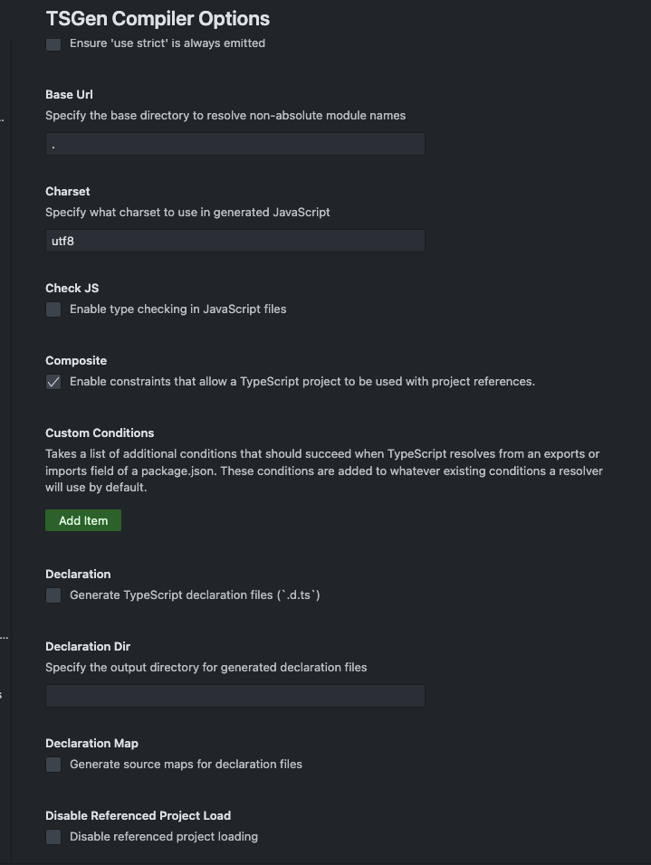

# TSConfig Generator (tsc-config)


TSConfig Generator is a Visual Studio Code extension that generates `tsconfig.json` files based on user settings.

## Features

- **Generate `tsconfig.json`**: Automatically generate a `tsconfig.json` file based on your settings in the extension.
- **Customizable Compiler Settings**: Control multiple TypeScript compiler options like `target`, `lib`, `jsx`, etc.
- **Incremental Compilation Support**: Support for features like `incremental` and `composite` compilation.
- **Advanced Project Management**: Handles complex project setups with `outDir`, `rootDir`, and others.



## Installation

1. Download and install Visual Studio Code.
2. Search for and install `TSConfig Generator` from the Extensions marketplace.
3. Reload Visual Studio Code if needed.

```bash
npm i -D tsc-config

## Configuration

The extension provides multiple configuration options in the settings:

- **Incremental Compilation**: Saves `.tsbuildinfo` files for incremental compilation.
- **Target JavaScript Version**: Choose the JavaScript language version to target (e.g., `ES6`, `ESNext`).
- **Libraries**: Select the runtime libraries needed for your project.

## Commands

- **Generate TSConfig**: Use the command palette (`Ctrl+Shift+P` or `Cmd+Shift+P` on Mac) to find the `Generate TypeScript Configuration` command and execute it.

## Contributing

Contributions are welcome! Please follow these steps to contribute:

1. Fork this repository.
2. Create a new branch: `git checkout -b feature-branch`.
3. Make your changes and commit them.
4. Push your branch: `git push origin feature-branch`.
5. Open a Pull Request (PR) and describe your changes.

## License

This project is licensed under the MIT License.
```
